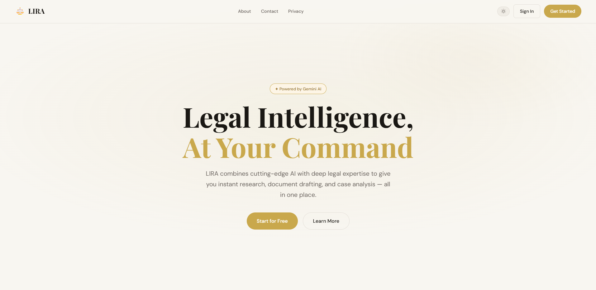
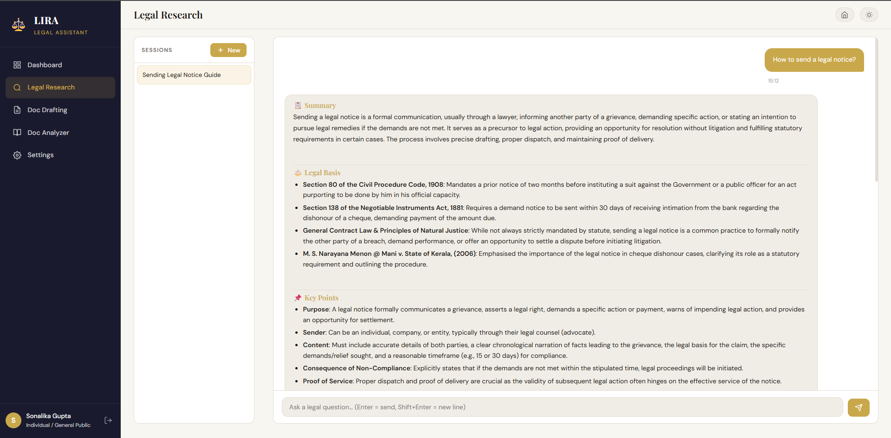
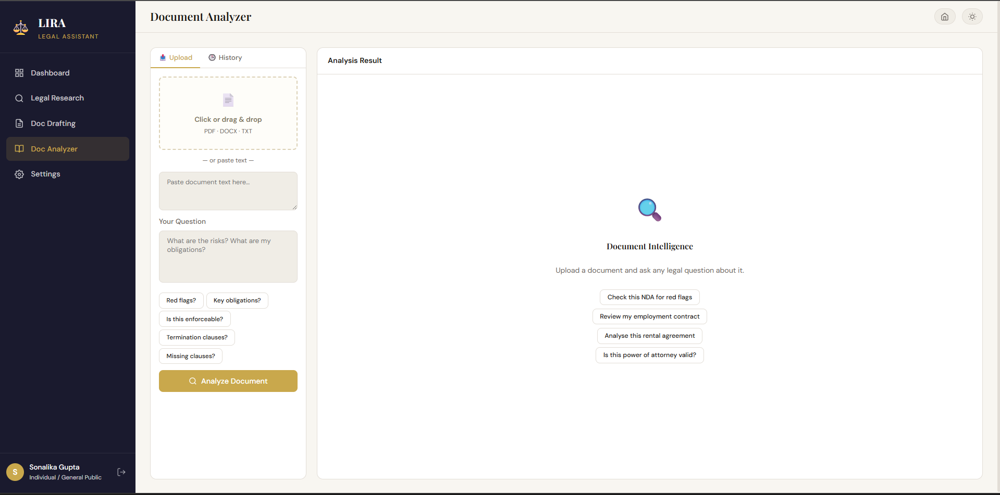
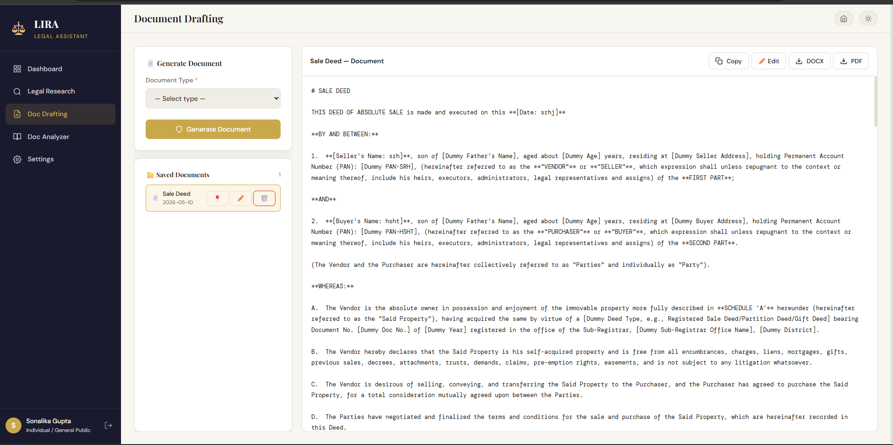
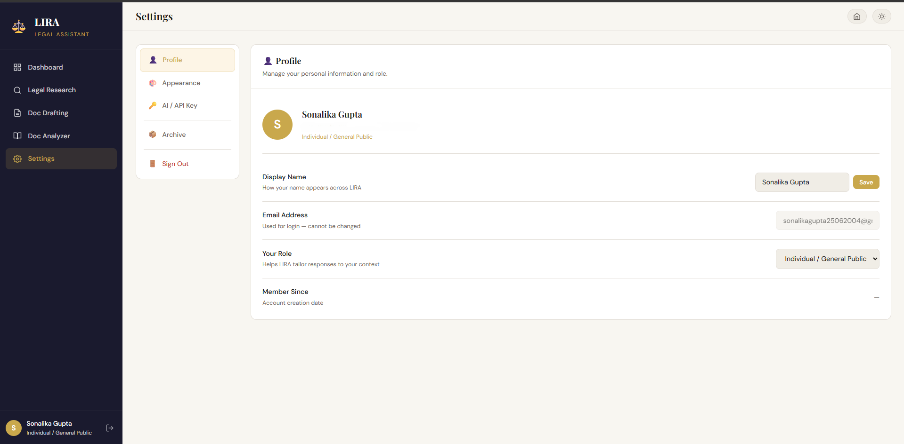
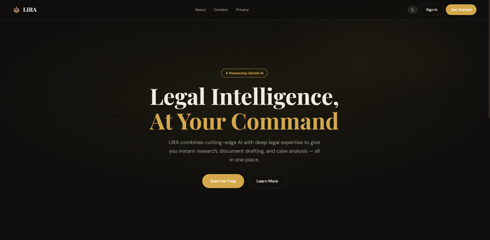

# ⚖️ LIRA — Legal Intelligence & Research Assistant

LIRA is an AI-powered legal intelligence platform built with Flask and Gemini API for legal research, conversational assistance, and automated legal document drafting.

It helps users:
- Research legal topics using AI
- Generate professional legal documents
- Manage research history
- Export documents as Word files
- Use a clean modern dashboard with dark/light themes

---

# ✨ Features

| Feature | Description |
|---|---|
| 🔍 AI Legal Research | Ask legal questions and receive structured AI-powered responses |
| 📄 Legal Document Drafting | Generate agreements, contracts, affidavits, NDAs, and more |
| ⬇️ DOCX Export | Download generated legal documents as `.docx` files |
| 💾 Research History | Save, revisit, rename, and delete research sessions |
| 🌗 Dark & Light Mode | User theme preferences saved locally |
| 🔒 Secure Authentication | Email/password authentication with bcrypt hashing |
| ⚡ Gemini AI Integration | Uses Google Gemini API for intelligent responses |
| 🗂 Session Management | Resume previous legal research conversations anytime |

---

# 🛠 Tech Stack

## Backend
- Python
- Flask
- Flask-Login
- SQLite
- bcrypt

## Frontend
- HTML5
- CSS3
- JavaScript
- Jinja2 Templates

## AI Integration
- Google Gemini API

## Document Generation
- python-docx

---

# 📸 Screenshots

## Home Page


## Legal Research


## Document Analyzer


## Document Drafting


## Setting


## Dark Mode


---

# 🚀 Quick Start

### 1. Clone the Repository

```bash
git clone https://github.com/your-username/LIRA.git
cd LIRA
```

### 2. Create Virtual Environment

#Windows
```bash
python -m venv venv
venv\Scripts\activate

#macOS / Linux
python3 -m venv venv
source venv/bin/activate
```

### 3. Install Dependencies
```bash
pip install -r requirements.txt
```

### 4. Set your Gemini API Key
**Option A — Environment variable (recommended):**
```bash
# Windows
set GEMINI_API_KEY=your_key_here

# macOS / Linux
export GEMINI_API_KEY=your_key_here
```

**Option B — In the app:**
Log in → Settings → AI Configuration → paste your key

Get a free Gemini API key at: https://aistudio.google.com/app/apikey

### 5. Run
```bash
python main.py
```

Open your browser at: **http://localhost:5000**

📂 Project Structure

```text
LIRA/
├── main.py
├── requirements.txt
├── data/
│   └── lira.db
│
├── backend/
│   ├── app.py
│   ├── database.py
│   ├── models.py
│   ├── ai_service.py
│   │
│   └── routes/
│       ├── home.py
│       ├── auth.py
│       ├── dashboard.py
│       ├── research.py
│       ├── drafting.py
│       ├── settings.py
│       └── pages.py
│
└── frontend/
    ├── templates/
    │   ├── base.html
    │   ├── app_layout.html
    │   ├── home.html
    │   ├── dashboard.html
    │   ├── research.html
    │   ├── drafting.html
    │   ├── settings.html
    │   │
    │   ├── auth/
    │   │   ├── login.html
    │   │   └── register.html
    │   │
    │   └── pages/
    │       ├── about.html
    │       ├── privacy.html
    │       └── contact.html
    │
    └── static/
        ├── css/main.css
        └── js/main.js
```


🌐 Routes
| Route                    | Description             |
| ------------------------ | ----------------------- |
| `/`                      | Public homepage         |
| `/auth/login`            | Login page              |
| `/auth/register`         | User registration       |
| `/dashboard/`            | User dashboard          |
| `/research/`             | Start legal research    |
| `/research/session/<id>` | Resume previous session |
| `/drafting/`             | Legal document drafting |
| `/settings/`             | User settings           |
| `/about`                 | About page              |
| `/privacy`               | Privacy policy          |
| `/contact`               | Contact page            |


📄 Supported Legal Documents

-Employment Contract
-Non-Disclosure Agreement (NDA)
-Rental / Lease Agreement
-Partnership Deed
-Sale Agreement
-Power of Attorney
-Affidavit
-Memorandum of Understanding (MOU)
-Freelance / Service Agreement
-Loan Agreement

🔐 Security Features

-Password hashing with bcrypt
-Session-based authentication
-Local SQLite storage
-Secure API key handling
-Protected authenticated routes

🧠 AI Features

-LIRA uses Google Gemini API for:
-Legal research assistance
-Legal explanation generation
-Structured legal answers
-Automated document drafting
-Context-aware conversations

📊 Future Improvements

-PDF export support
-OCR for scanned legal documents
-AI-powered clause risk analysis
-Legal citation verification
-Multi-user cloud synchronization
-Advanced legal precedent search
-Voice-assisted legal queries

⚠️ Disclaimer

LIRA is an AI-assisted legal research and drafting tool and does not constitute professional legal advice.
Users should consult a licensed legal professional before making legal decisions.

🤝 Contributing

Contributions, feature suggestions, and improvements are welcome.

ork the repository

Create a feature branch

Commit your changes

Open a pull request

👨‍💻 Author

Developed by Sonalika Gupta

GitHub: https://github.com/Sgsonalika
